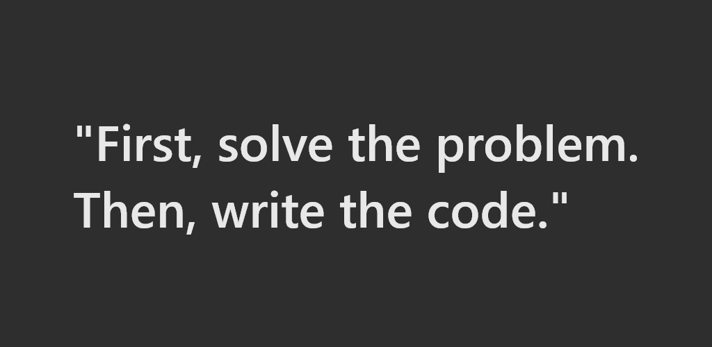

# Hi 👋, I'm Pemberai

## I'm a builder, automator, practising the art of Software Engineering

  

  
## About

* **Programming** - Javascript, Typescript, C#, Python, SQL, HTML/CSS 
* **Frontend/Mobile** - Angular, React, Webpack, Redux, UI/UX, React Native, Ionic 
* **Backend** - Node.js, Express.js, .NET Core, SQL Server, MySQL, PostgreSQL, DynamoDB 
* **General** - TDD, BDD, CI/CD, Git, AWS, Azure, Docker, K8s 

 

- 💬 Ask me about **JavaScript, Angular, React, Node.js**
- 📫 How to reach me **pembeweb@yahoo.com**

## 📈 Github Stats

<!-- https://github.com/anuraghazra/github-readme-stats -->

  
📊 GitHub Profile Stats

   
  

 
  
💻 Most used languages

   
  
   
  <b>Note:</b> This chart is only a metric of which languages my public code on GitHub consists of and does not reflect my experience or skill level.

